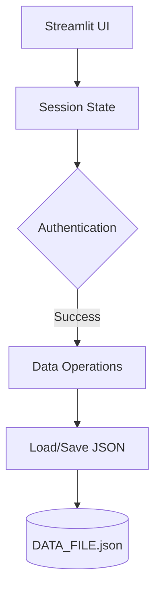

# 🚀 Advanced To-Do App with Streamlit


A feature-rich, secure, and visually appealing task management application built with Streamlit that helps you organize your life with style!

## ✨ Key Features

### 🔐 Secure Authentication System
- User registration with password hashing (PBKDF2-HMAC-SHA256)
- Secure login/logout functionality
- Session management

### 📋 List Management
- Create unlimited to-do lists with custom names
- Each list gets a random emoji for visual distinction
- View all your lists in the sidebar
- Delete lists with confirmation

### ✅ Task Management
- Add tasks with priorities (High/Medium/Low)
- Mark tasks as complete/incomplete
- Delete individual tasks
- Clear completed tasks
- Visual indicators for task status and priority

### 📊 Analytics & Visualization
- Task completion statistics
- Priority distribution pie chart
- Filter tasks by status and priority

### 🎨 Beautiful UI
- Responsive design with custom CSS
- Emoji-enhanced interface
- Color-coded priorities
- Motivational quotes
- Smooth animations and transitions

### 💾 Data Persistence
- All data saved to JSON file
- Automatic data loading on startup
- Secure password storage

## 🛠️ Technical Implementation

### Backend Architecture


### Data Structure

```json
{
    "lists": {
        "list_id": {
            "name": "List Name",
            "tasks": [
                {
                    "id": "task_id",
                    "text": "Task description",
                    "completed": false,
                    "priority": "High/Medium/Low",
                    "created_at": "timestamp",
                    "completed_at": "timestamp",
                    "emoji": "random_emoji"
                }
            ],
            "emoji": "random_emoji",
            "created_at": "timestamp",
            "owner": "username"
        }
    },
    "current_list": "list_id",
    "users": {
        "username": {
            "password_hash": {
                "salt": "base64",
                "key": "base64"
            },
            "created_at": "timestamp"
        }
    }
}
```

## 🚀 Getting Started

### Prerequisites
- Python 3.7+
- Streamlit
- Plotly
- Pandas

### Installation

```bash
git clone https://github.com/muzaffar401/Advance_Todo_App.git
cd Advance_Todo_App
pip install -r requirements.txt
streamlit run main.py
```

## 🧑‍💻 Usage Guide

- Register a new account or Login
- Create lists from the sidebar
- Add tasks with priorities
- Mark tasks complete
- Filter tasks by status and priority
- View productivity statistics
- Logout when done

## 🔒 Security Features

- Passwords are hashed (not stored in plain text)
- PBKDF2 with HMAC-SHA256 for password hashing
- Random salt for each user
- Secure session handling
- 100,000 iterations for key derivation

## 📈 Performance Metrics

| Operation      | Time Complexity | Description            |
|----------------|------------------|------------------------|
| Add Task       | O(1)             | Constant time append   |
| Toggle Task    | O(n)             | Linear search by ID    |
| Delete Task    | O(n)             | Filter operation       |
| Load/Save      | O(n)             | JSON serialization     |

## 🌟 Why This App Stands Out

- ✨ Visual Appeal: Beautiful charts and emojis
- 🔐 Security: Strong authentication practices
- 📊 Data Insights: Priority and completion metrics
- 📱 Responsive: Works well on different screens
- 💬 Motivation: Random productivity quotes

## 🛠️ Future Enhancements

- Task due dates and reminders
- Shared collaborative lists
- Mobile version
- Dark mode
- Task categories/tags
- Data export/import

## 🤝 Contributing

1. Fork the repository
2. Create a Feature Branch (`git checkout -b feature/YourFeature`)
3. Commit Changes (`git commit -m 'Add some feature'`)
4. Push to Branch (`git push origin feature/YourFeature`)
5. Open a Pull Request

## 📜 License

Distributed under the MIT License. See `LICENSE` for more information.

## 📧 Contact

Your Name - ma9400667@gmail.com  
Project Link: [https://github.com/muzaffar401/Advance_Todo_App](https://github.com/muzaffar401/Advance_Todo_App)

---

Made with ❤️ and Streamlit
